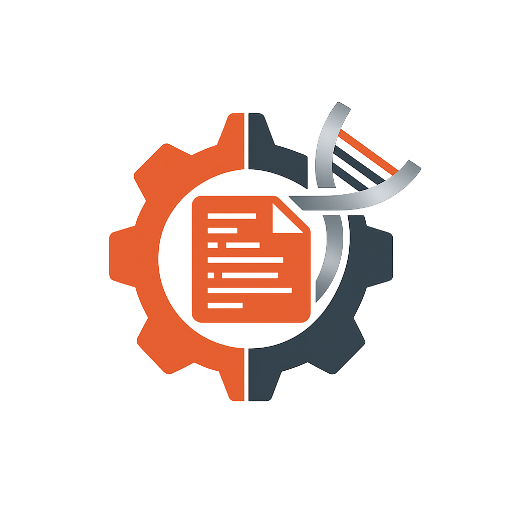

<p align="center">
  <p align="center">
    
  </p>

  <span>
    <h1 align="center">
        genepred
    </h1>
  </span>

  <p align="center">
    <a href="https://img.shields.io/badge/version-0.0.2-green" target="_blank">
      
    </a>
    <a href="https://crates.io/crates/genepred" target="_blank">
      
    </a>
    <a href="https://github.com/alejandrogzi/genepred" target="_blank">
      
    </a>
    <a href="https://crates.io/crates/genepred" target="_blank">
      
    </a>
  </p>

  <p align="center">
    <samp>
        <span> a port for the GenePred format in Rust</span>
        <br>
        <br>
        <a href="https://docs.rs/genepred/0.0.2/genepred/">docs</a> .
        <a href="https://github.com/alejandrogzi/genepred?tab=readme-ov-file#Usage">usage</a> .
        <a href="https://github.com/alejandrogzi/genepred?tab=readme-ov-file#Features">features</a> .
        <a href="https://github.com/alejandrogzi/genepred/blob/master/assets/EXAMPLES.md">examples</a>
    </samp>
  </p>

</p>

## Overview

This library provides a port to read genomic interval data in BED, GTF, and GFF (+ gz/zst/bz2) formats, representing them all as `GenePred` records.

## Quick Start

Add this to your `Cargo.toml`:

```toml
[dependencies]
genepred = "0.0.4"

# Optional features
genepred = { version = "0.0.4", features = ["gzip", "zstd", "bz2", "mmap", "rayon"] }
```

## Usage

```rust,no_run
// Enable both "rayon" and "mmap" features in Cargo.toml
use genepred::{Reader, Bed12, Gtf};
use rayon::prelude::*;

fn main() -> Result<(), Box<dyn std::error::Error>> {
    // Parallel processing of BED files, includes .gz/.zst/.bz2 files
    let bed_reader = Reader::<Bed12>::from_mmap("data/large.bed")?;

    if let Ok(records) = bed_reader.par_records() {
        let count = records
            .filter_map(Result::ok)
            .filter(|r| r.strand.map(|s| s.is_plus()).unwrap_or(false))
            .count();
        println!("Found {} records on plus strand", count);
    }

    // Parallel processing of GTF files, includes .gz/.zst/.bz2 files
    let gtf_reader = Reader::<Gtf>::from_mmap("data/annotations.gtf")?;

    if let Ok(records) = gtf_reader.par_records() {
        let total_exons: usize = records
            .filter_map(Result::ok)
            .map(|r| r.exon_count())
            .sum();
        println!("Total exons: {}", total_exons);
    }

    Ok(())
}
```

### Features

- `mmap`: Enable memory-mapped file support (adds `memmap2` dependency)
- `rayon`: Enable parallel processing (adds `rayon` dependency)
- `gzip`: Enable gzip support (adds `flate2` dependency)
- `zstd`: Enable zstd support (adds `zstd` dependency)
- `bz2`: Enable bzip2 support (adds `bzip2` dependency)

